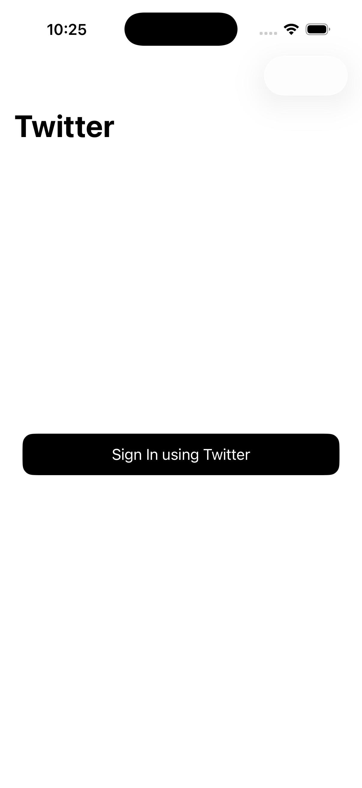
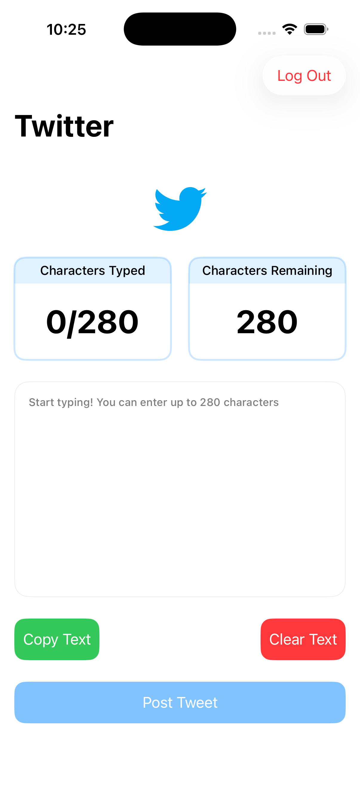

# Halan-Twitter-Task

An iOS application built as a technical task for **Halan**, demonstrating Twitter authentication using **OAuth 2.0**, tweet posting via Twitter APIs, and accurate tweet character counting based on Twitter’s official rules.

---

## 📱 App Overview

The app allows users to:

- Sign in using **Twitter OAuth 2.0**
- Compose and post tweets via Twitter APIs
- View a **real-time tweet character counter** that follows Twitter’s counting logic

---
<p float="left">
  
  
</p>

## ✨ Features

- Twitter authentication (OAuth 2.0)
- Post tweets using Twitter APIs
- Accurate tweet character counting
  - URLs counted using Twitter rules
  - Emoji & Unicode-aware
  - Manage tweet text (copy + clear)
- Clean, testable architecture
- Unit tests for core logic

---

## 🏗 Architecture

The project follows **MVVM with Clean Architecture**, ensuring separation of concerns and testability.


### Key Concepts

- MVVM pattern
- Protocol-oriented programming
- Dependency injection
- Testable business logic

---

## 🛠 Tech Stack

- **Language:** Swift
- **UI:** SwiftUI
- **Architecture:** MVVM + Clean Architecture
- **Reactive:** Combine
- **Concurrency:** Swift Concurrency (`async/await`)
- **Networking:** URLSession
- **Authentication:** Twitter OAuth 2.0
- **Testing:** XCTest

---

## 🚀 Getting Started

### Requirements

- Xcode 15+
- iOS 16+
- Twitter Developer Account
- OAuth 2.0 credentials

### Installation

1. Clone the repository:
   ```bash
   git clone https://github.com/your-username/halan-twitter-task.git

2. open HalanTwitterTask.xcodeproj
   
3. Configure Twitter OAuth:
    Add your Client ID
    Set the Redirect URI
    Ensure values match your Twitter Developer Portal configuration
